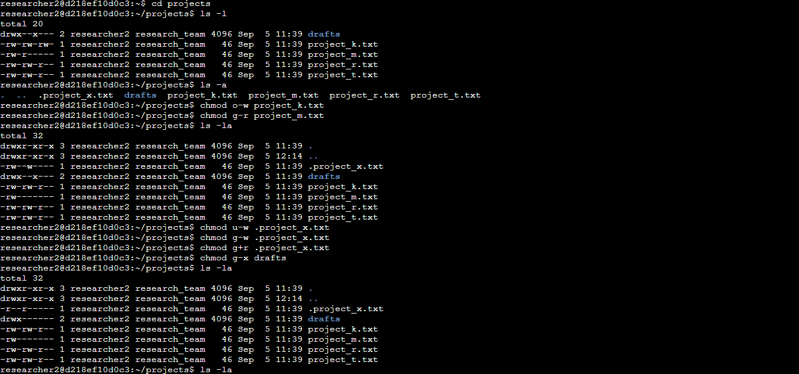

# 🔐 Linux File Permissions Lab  

This project demonstrates how to check and modify file and directory permissions in Linux using `ls -la` and `chmod`.  
The objective was to ensure files and directories follow organizational security policies by applying the principle of least privilege.  

## 📸 Screenshot  
Below is the screenshot showing the commands and outputs from this lab:  

 

## 🛠️ Skills Highlighted  
- 📂 Reviewing permissions with `ls -la`  
- ⚙️ Modifying permissions with `chmod`  
- 🛡️ Enforcing least privilege in Linux systems  
